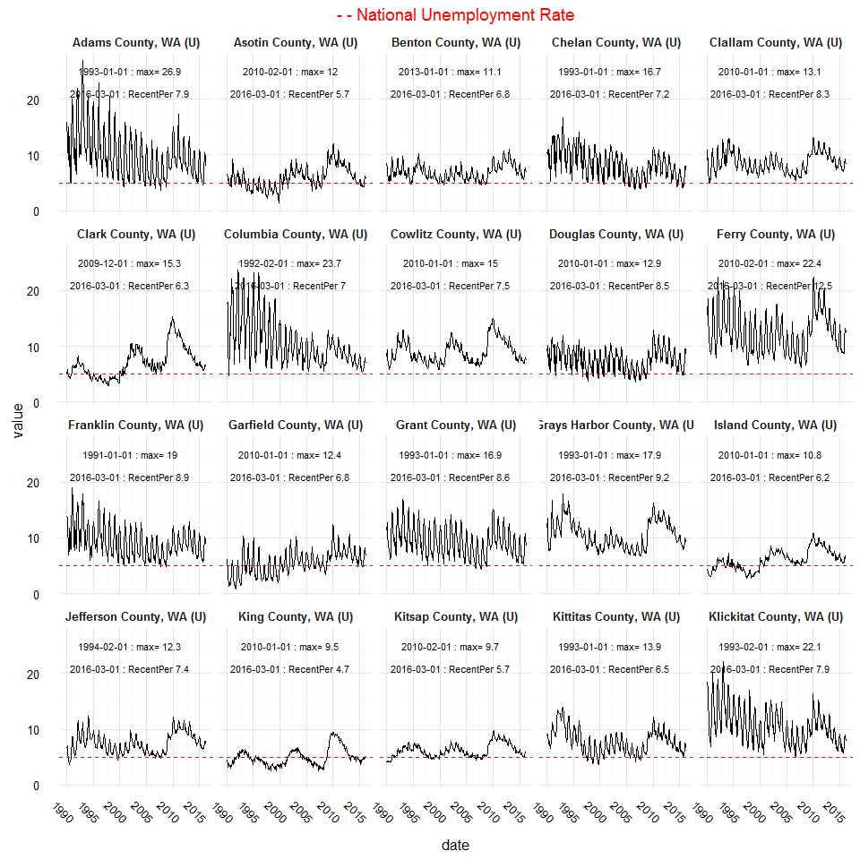
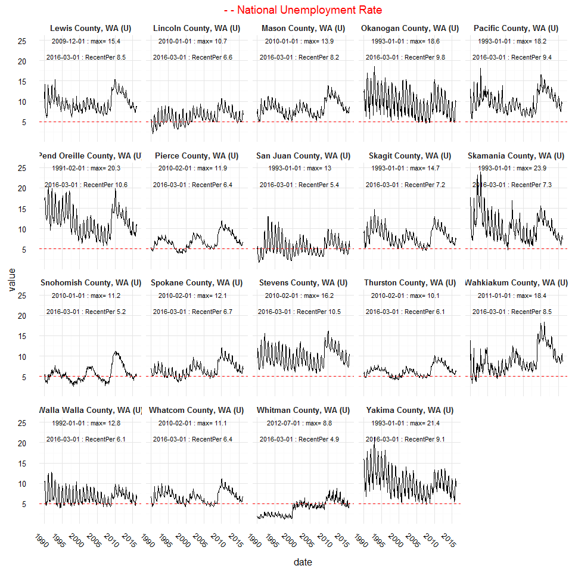

# BLS Data Analysis

The [Bureau of Labor Statistics (BLS)](www.bls.gov) hosts a huge repository of survey data that has been captured over a long-period of time to compare trends across a number of sectors and geographies. The Bureau has built a number of tools around this data to make the information widely available and successful, though at times the documentation can be more limited within these tools. This post is inspired by some scripts authored by [Ben Casselman](https://github.com/BenCasselman) of [FiveThirtyEight](fivethirtyeight.com) who covers economic trends. Since his scripts focus largely on national employment data conducted in the Community Population Survey (CPS), while this will focus on the Local Area Unemployment Statistics. The data will come from the public [LABSTAT database](http://download.bls.gov/pub/time.series/overview.txt). 

###Install Packages

First we will install the prerequesite packages

```r
if(!require(stringr)){
  install.packages("stringr")
  library(stringr)
}
if(!require(dplyr)){
  install.packages("dplyr")
  library(dplyr)
}
if(!require(ggplot2)){
  install.packages("ggplot2")
  library(ggplot2)
}

if(!require(tidyr)){
  install.packages("tidyr")
  library(tidyr)
}

if(!require(reshape2)){
  install.packages("reshape2")
  library(reshape2)
}
```

###Download The First File
First we will download the WA local area file


```r
#Create temporary file
temp <- tempfile()
#download census time-series data from bls -- WA State in this case
dfUE <- download.file("http://download.bls.gov/pub/time.series/la/la.data.56.Washington", temp)
#Read table into environment
dfUEWA <-read.table(temp,
                     header=TRUE,
                     sep="\t",
                     stringsAsFactors=FALSE,
                     strip.white=TRUE)

unlink(temp) #remove/unlink temp table to preserve memory
```


```r
######################All other downloads remain the same for Local Area Employment Figures
temp <- tempfile()
dfUEHeaders <- download.file("http://download.bls.gov/pub/time.series/la/la.series", temp)
dfUEHeaders <- read.table(temp,
                          header = T,
                          sep = "\t",
                          stringsAsFactors = F,
                          strip.white = T)

unlink(temp)

#Merge data
df_UE_WA <- merge(dfUEWA, dfUEHeaders, by = "series_id")
```

###Download Mapped Descriptors

We will download and merge the following files together. This step is not necessary -- one can simply use the existing codes, but I prefer to have the descriptors within my dataset for additional clarity. 

* Area Code Mapping
* Area Type Mapping
* Measurement Mapping

#####Download Area Code Mapping and Merge

```r
#la.area				-  Area code (mapping file)
temp <- tempfile()
dfUEArea <- download.file("http://download.bls.gov/pub/time.series/la/la.area", temp)
dfUEArea <- read.table(temp,
                       header = T, 
                       sep = "\t", 
                       stringsAsFactors = F,
                       strip.white = T,
                       row.names = NULL) #note additional input, prevent reading first row in as colummns
unlink(temp)
#Fix first column names
colnames(dfUEArea) <- c("area_type_code",	"area_code",	"area_text",	"display_level",	"selectable",	"sort_sequence")

#Merge area and employment figures
df_UE_WA1 <- merge(df_UE_WA, dfUEArea, by = "area_code", all.x = T)
```

######Download Area Type Codes and Merge

```r
#################
#la.area.type			-  Area type codes (mapping file)
################
temp <- tempfile()
dfUEArea2 <- download.file("http://download.bls.gov/pub/time.series/la/la.area_type", temp)

dfUEArea2 <- read.table(temp,
                        header = T,
                        sep = "\t",
                        stringsAsFactors = F,
                        strip.white = T,
                        row.names = NULL)
unlink(temp)
colnames(dfUEArea2) <- c("area_type_code", "areatype_text")
df_UE_WA2 <- merge(df_UE_WA1, dfUEArea2, by.x = "area_type_code.x", by.y = "area_type_code", all.x = T)
```

#####Download Measurement Codes and Merge

```r
##########
#la.measure			-  Measure codes (mapping file)
##########
temp <- tempfile()
dfMeasure <- download.file("http://download.bls.gov/pub/time.series/la/la.measure", temp)
dfMeasure <- read.table(temp,
                        header = T,
                        sep = "\t", 
                        stringsAsFactors = F,
                        strip.white = T,
                        row.names = NULL)
colnames(dfMeasure) <- c("measure_code", "measure_text")
unlink(temp)

#we lost leading zeros in our merged dataset so need to pad 1 -- us stringr package
df_UE_WA2$measure_code <- str_pad(df_UE_WA2$measure_code, 2, pad = "0")

df_UE_WA3 <- merge(df_UE_WA2, dfMeasure, by = "measure_code", all.x = T)
```

###Basic Data Cleaning to Full Set

There is some minor data cleaning required to ensure the fields are in the proper data types. 


```r
#############################################
#Take only the measures needed from full combined set
############################################

#clean environment of all datasets if you would like
#rm(list = setdiff(ls(), "df_UE_Combined"))

#Removes the M13 = average annual value
df_UE_Combined <- df_UE_WA3%>%
  select(series_id, series_title, area_code, areatype_text, area_text, year, period, value, measure_text)%>%
  filter(period != "M13")%>%
  arrange(series_title, year, period)

#############################################
#Cleanup data types for plotting
#############################################


#Remove M from period to seperate month
df_UE_Combined$month <- as.integer(gsub("[^0-9]", "", df_UE_Combined$period))
#Combine as full date
df_UE_Combined$date <- as.Date(paste(df_UE_Combined$year, df_UE_Combined$month, "01", sep = "-"),
                               format = "%Y-%m-%d")
#Convert values for graphing
df_UE_Combined$value <- as.numeric(as.character(df_UE_Combined$value))

#Remove the fore-title from the series_title, as it will be replaced with 
#the main title of the plot

df_UE_Combined$series_title <- gsub("^[^:]+:\\s*", "", df_UE_Combined$series_title)
```

Then take subsets of datasets so they fit properly in our post!


```r
#################
#Create manageable graphical df's
################

countyRate <- df_UE_Combined %>%
  filter(areatype_text == "Counties and equivalents" &
           measure_text == "unemployment rate")%>%
  select(series_title, date, value) %>%
  arrange(series_title, date)

#Get max rate so you can annotate the plot
countyRateMax <- countyRate %>%
  select(series_title, date, value)%>%
  group_by(series_title)%>%
  mutate(max = paste(date,": max=", value))%>%
  slice(which.max(value))%>%
  as.data.frame()

#Get minimum rate and year to annotate plot
countyRateMin <- countyRate %>%
  select(series_title, date, value)%>%
  group_by(series_title)%>%
  mutate(max = paste(date,": min", value))%>%
  slice(which.min(value))%>%
  as.data.frame()

#Get most recent period to annotate plot
countyRecentPer <- countyRate %>%
  select(series_title, date, value)%>%
  group_by(series_title)%>%
  mutate(recentPer = paste(date,": RecentPer", value))%>%
  slice(which.max(date))%>%
  as.data.frame()

#Too large for rmarkdown, can ggsave as 8.5 x 11 though
# #ggplot(countyRate, aes(x = date, y = value))+
#   geom_line()+
#   facet_wrap(~series_title)+
#   geom_text(data = countyRateMax, aes(x=date, y= (value + 1), label=max), 
#           hjust = 0.15, colour="black", inherit.aes=FALSE, parse=FALSE)+
#   geom_hline(yintercept = 5.0, color = 'red', linetype = "dashed")

#Gather all of the series_titles to quickly subset our data to make smaller
#number of facets
title <- countyRate[!duplicated(countyRate$series_title),1]

countyRateSub1 <- countyRate %>%
  filter(series_title %in% title[1:20])
countyRateSub2 <- countyRate %>%
  filter(series_title %in% title[21:39])

countyRateMaxSub1 <- countyRateMax %>%
  filter(series_title %in% title[1:20])
countyRateMaxSub2 <- countyRateMax %>%
  filter(series_title %in% title[21:39])

countyRecentPerSub1 <- countyRecentPer %>%
  filter(series_title %in% title[1:20])

countyRecentPerSub2 <- countyRecentPer %>%
  filter(series_title %in% title[21:39])
```

###Let's Make a Plot!

We will gather our data with dplyr and then plot with ggplot2.

###Unemployment Rate by WA County

```r
ggplot(countyRateSub1, aes(x = date, y = value))+
  geom_line()+
  facet_wrap(~series_title)+
  geom_text(data = countyRateMaxSub1, aes(x=as.Date("2002-01-01"), y= 25, label=max), 
          size = 3, colour="black", inherit.aes=FALSE, parse=FALSE)+
  geom_text(data = countyRecentPerSub1, aes(x = as.Date("2002-01-01"), y = 21, label = recentPer), size = 3, colour="black", inherit.aes=FALSE, parse=FALSE)+
  geom_hline(yintercept = 5.0, color = 'red', linetype = "dashed")+
  labs(title = "- - National Unemployment Rate", xlab = NULL, ylab="Unemployment Rate %")+
  theme_minimal()+
  theme(axis.title.x = element_text(),
        axis.title.y = element_text(),
        axis.text.x = element_text(angle = -45),
        strip.text.x = element_text(face = "bold"),
        plot.title = element_text(color = "red")
        )
```



```r
ggplot(countyRateSub2, aes(x = date, y = value))+
  geom_line()+
  facet_wrap(~series_title)+
  geom_text(data = countyRateMaxSub2, aes(x=as.Date("2002-01-01"), y= 25, label=max), 
            size = 3, colour="black", inherit.aes=FALSE, parse=FALSE)+
  geom_text(data = countyRecentPerSub2, aes(x = as.Date("2002-01-01"), y = 21, label = recentPer),  
           size = 3, colour="black", inherit.aes=FALSE, parse=FALSE)+
  geom_hline(yintercept = 5.0, color = 'red', linetype = "dashed")+
   labs(title = "- - National Unemployment Rate", xlab = NULL, ylab="Unemployment Rate %")+
  theme_minimal()+
  theme(axis.title.x = element_text(),
        axis.title.y = element_text(),
        axis.text.x = element_text(angle = -45),
        strip.text.x = element_text(face = "bold"),
        plot.title = element_text(color = "red")
        )
```



```r
#listCountyRate<-split(countyRate, countyRate$series_title)
```
